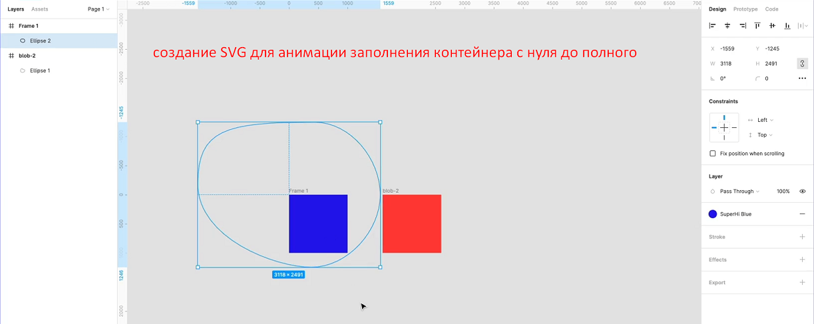

# 🔥 Animation_guide 🔥

* https://svg-art.ru/
* https://css-tricks.com/svg-line-animation-works/

### 💡 Свойство `transition` указывать как свойство элемента НАД которым совершаю действие

* имя свойства | длительность | временная функция | задержка
* `transition: margin-left 4s ease-in-out 1s;`
*
* Применить к 2 свойствам
* `transition: margin-left 4s, color 1s;`

### bezier function 🔗 https://cubic-bezier.com/

## SVG

> https://developer.mozilla.org/ru/docs/Web/SVG
>
> https://css-tricks.com/svg-properties-and-css/
> пример css

```css
svg.spiral {
    border: 2px solid var(--highlight-color);
}

svg.spiral rect {
    /*заливка*/
    fill: var(--highlight-color);
    /*прозрачность*/
    fill-opacity: 0;
    /*обводка*/
    stroke: var(--highlight-color);
}

svg.spiral rect:hover {
    fill-opacity: 0.25;
}
```

### Work with SVG in Figma


> тогда в `id` будут названия групп ,которые дал(по-умолчанию они `group`)

### Change d in path

> CSS:
> https://stackoverflow.com/questions/68630016/changing-svg-path-by-using-css
>
> JS:
> https://stackoverflow.com/questions/6813931/change-svg-path-with-javascript

```css
/* CSS */
svg {
    overflow: initial;
}

path {
    transition: d 0.5s;
}

svg:hover path {
    d: path('M 850 300 C 850 300 350 300 350 300 L 348.1 205.39 L 120 400.39 L 348.1 606.19 L 350 500 C 850 500 850 500 850 500 z') !important;
}
```

#### `<g></g>`

>
>Элемент `g` используется для группировки других SVG элементов. Любые преобразования применяемые к g элементу
> наследуются
> его дочерними элементами.
>

```html

<svg viewBox="0 0 1000 1000" preserveAspectRatio="xMidYMid slice">
    <g class="blob">
        <g transform="translate(1100, 1100)">
            <path d="M1559 3.58236C1559.../></g>
      <g transform=" translate(-100, -100)
            ">
            <path d="M1559 3.58236C1559.../>
      </g>
    </g>
</svg>
```

> `viewBox` — это набор четырёх чисел: `min-x`, `min-y`, `width` и `height`
>
> На отображение с `viewBox` также влияет атрибут `preserveAspectRatio`

### анимация SVG заливки контейнера элементом


> далее `<path d="M1559 3.58236C1559.../>` вставил в элемент `<g>` похожий на тот, что выше в коде

```css
/* STYLE FOR SVG */
svg {
    position: fixed;
    top: 0;
    left: 0;
    width: 100%;
    height: 100vh;
    mix-blend-mode: multiply;
}

path {
    transform: scale(0);
    transition: transform 5s;
}

/* adding class in-view  */
g.blob.in-view path {
    transform: scale(1);
}

```

## 💡 GSAP

* `yoyo: true, repeat: -1 `
  > `yoyo: true` Gets or sets the timeline's `yoyo` state, where `true` causes the `timeline` to go back and forth,
  alternating backward and forward on each repeat.
  > if `repeat` is `1`, the `timeline will` play a total of twice (the initial play plus 1 repeat). To repeat
  INDEFINITELY, use `-1`.
* `tl.fromTo('.text', {x:30, opacity:0},{x:0,opacity:1}, '<')`
  > `<` - эта анимация ОДНОВРЕМЕННО с предидущей
  > если `<50%`  - 50% задержки
* чтобы части svg были видны за пределами элемента при их захожднии за пределы фигуры
  > необходимо, но НЕДОСТАТОЧНО `overflow: visible; `
  > ещё нужно удалить `<clipPath id="clip0_1_4"><rect width="98" height="98" fill="white"/></clipPath>` из тела `svg`
* `clipPath` - CSS свойство clip-path создаёт ограниченную область, которая определяет какая часть элемента должна быть
  видимой. Те части, которые находятся внутри области, видимы, в то время как части вне области, скрыты.
* `{ y: 0, opacity:1 ,delay: 2, stagger: 0.1, ease: "back.out(3)" }`
  > `stagger` задаёт задержку применения анимации к каждому элементу поочерёдно
  > https://greensock.com/docs/v3/Staggers
  >
  > `stagger` можкт быть отрицательным - то же самое, но в обратном порядке, так что последний элемент будет начинаться
  первым.
* 🔥 `span` - inline элемент поэтому не будет реагировать на `transform: translate()`
  > решение  `gsap.set(".letter", { display: "inline-block" });`

### preserveAspectRatio

> https://developer.mozilla.org/en-US/docs/Web/SVG/Attribute/preserveAspectRatio
> The preserveAspectRatio attribute indicates how an element with a viewBox providing a given aspect ratio must fit into
> a viewport with a different aspect ratio.

### GSAP example

* `const tl = gsap.timeline({ default:{duration: 0.35, ease: "Power2.easeOut"}})`
* добавил в `addEventListener` на click `gsap.fromTo(".home-svg", { scale: 1 }, { scale: 0.9})`
  > жизнь `.home-svg`:
  > 1. имеет размер  `scale: 1`
  > 2. на клик он за `0.35s` получает `scale: 0.9` и остаётся в нём
  > 3. повторный клик возвращает на `scale: 1` с последующим `scale: 0.9`
* добавление `yoyo: true, repeat: 1` исправляет проблему
  > `gsap.fromTo(".home-svg", { scale: 1 }, { scale: 0.9, yoyo: true, repeat: 1 })`

### 💡 `rotate()` in GSAP is `rotation`

### `.repeatDelay( value:Number ) `:

* Gets or sets the amount of time in seconds (or frames for frames-based tweens) between repeats.`

### GSAP example

* `tl.fromTo(".messages-svg", { scale: 1 }, { scale: 0.9 });` - объект "замёрз" на `scale: 0.9`
* `tl.fromTo(".flap", { scale: 1 }, { scale: -1 }, "<50%");` - что-то ещё
* `tl.fromTo(".messages-svg", { scale: 0.9 }, { scale: 1 }, "<50%");` - объект вернул на `scale: 1`

### GSAP example

#### работа с двумя заголовками

```js
const carousels = document.querySelectorAll('h1, h2')
const fadeInTimeline = gsap.timeline()

fadeInTimeline
    .set(carousels, {opacity: 0})
    .to(carousels, {opacity: 1, delay: 1, stagger: 1, duration: 3})


```

* абзацы будут поочерёдно (за это отвечает `stagger: 1`) появляться

>
> `fadeInTimeline.fromTo()` не тоже самое как `fadeInTimeline.set().to()` ,т.к в первом случае мгновение будет видно
> элемент со свойствами из `style.css`
>

#### бегущая сторока

```js
const carousels = document.querySelectorAll("header h1, header h2")

const fadeInTimeline = gsap.timeline()

carousels.forEach(carousel => {
    const spanTag = carousel.querySelector("span")
    const spanWidth = spanTag.clientWidth

    for (let i = 0; i < 20; i = i + 1) {
        carousel.appendChild(spanTag.cloneNode(true))
    }
    //Метод Node.cloneNode() возвращает дубликат узла, из которого этот метод был вызван.
    const movementTimeline = gsap.timeline({
        repeat: -1
    })

    movementTimeline
        .set(carousel, {x: 0})
        .to(carousel, {x: spanWidth * -1, duration: 6, ease: "linear"})
})

```

> ширина заголовков разная, поэтому скорость движения разная (за скорость анимации отвечает `duration`)
> https://codepen.io/jorgenb/pen/QWaKzZG

#### Дёргающаяся прямая линия SVG

* нужно в фигме скопировать дефолтное состояние фигуры
* поставить точку на линии, протянуть "усики" точки
* поднять или опустить точку линии и скопировать это состояние SVG
* взять значения d="M0 0.999512C0..." дефолтное и изменённое

```js
// svg
const line = container.querySelector(".elastic-line");
// проверка на наполненность поля input
if (!input.value) {
    tl.fromTo(
        line,
        {attr: {d: start}},
        {attr: {d: end}, ease: "Power2.easeOut", duration: 0.75}
    );
    tl.to(line, {attr: {d: start}, ease: "elastic.out(3,0.5)"}, "<50%");
```

### 💡 GSAP Функции в свойствах

```js
imagesLoaded(images, function () {
    const timeline = gsap.timeline()

    timeline
        .set(images, {
            x: () => {
                return 500 * Math.random() - 250
            },
            y: "500%",
            rotation: () => {
                return 90 * Math.random() - 45
            },
            opacity: 1
        })
        .to(images, {x: 0, y: 0, stagger: -0.25})
        .to(images, {
            rotation: () => {
                return 16 * Math.random() - 8
            }
        })
})
``` 

### SVGGeometryElement.getTotalLength()

> The SVGGeometryElement.getTotalLength() method returns the user agent's computed value for the total length of the
> path in user units.
> У svg length не взять, нужно цепляться к path внутри svg

### `transform-origin`

* https://developer.mozilla.org/en-US/docs/Web/CSS/transform-origin
* https://www.w3schools.com/cssref/css3_pr_transform-origin.asp

### `matrix`

* The parameters are as follow: `matrix(scaleX(),skewY(),skewX(),scaleY(),translateX(),translateY())`

### 💡 `scale: -1` перевернёт элемент на 180deg

### 💡 Как реализовать смену картинки при клике:

``` js
//global var: 
let current = 0; let z = 1000  
// slides - контейнер, imges - массив картинок в нём
// если контейнер с картинками не один, то slides.forEach..
slides.addEventListener("click", () => {
  z = z - 1
  imges[current].style.zIndex = z
  
  current = current + 1
  // чтобы начинать с нуля когда дойдёт до конца
  current = current % imges.length
})
```

### 💡 Смещение элемента

> Если элемент в конце уменьшается, то он сместится от левого края, т.к. уменьшение идёт от его центра (`left: 0` не
> поможет)
>
> РЕШЕНИЕ: `transform-origin: left`

### 💡 `flex: 0 0 auto`

> `flex-shrink: 0` - элемент не будет сжиматься

### 💡 document.activeElement

> Возвращает текущий сфокусированный элемент

```js 
if (document.activeElement !== input) {
}
```

### 💡 e.target.type

> покажет значение type для input который получил событие

```js
if (e.target.type === "text") {
    let inputText = e.target.value;
    if (inputText.length > 2) {
        colorize("#6391E8", line, placeholder);
    } else {
        colorize("#FE8C99", line, placeholder);
    }
}
```

### stroke-dashoffset

https://www.youtube.com/watch?v=s--_-2YPkX0
https://css-tricks.com/almanac/properties/s/stroke-dashoffset/
> in GSAP `strokeDashoffset`
> задаёт смещение пуктивной обводки относительно первоначального положения

### stroke-dasharray

> задаёт сдвиг линии
https://css-tricks.com/svg-line-animation-works/
>

### GSAP. Простая анимация рисования SVG

```js
const tickMarkPath = document.querySelector(".tick-mark path");
const pathLength = tickMarkPath.getTotalLength();

gsap.set(tickMarkPath, {
    strokeDashoffset: pathLength,
    strokeDasharray: pathLength,
});
checkbox.addEventListener("click", () => {
    if (checkbox.checked) {
        tl2.fromTo(
            tickMarkPath,
            {strokeDashoffset: pathLength},
            {strokeDashoffset: 0},
            "<50%"
        );

    } else {
        tl2.fromTo(
            tickMarkPath,
            {strokeDashoffset: 0},
            {strokeDashoffset: pathLength},
            "<50%"
        );
    }
});
```

### `pointer-events: none`

> элемент НЕ может стать объектом события мыши (прячем его, но не удаляем)

### GSAP. ScrollTrigger

>
> https://greensock.com/docs/v3/Plugins/ScrollTrigger

 ```js
const tlIntro = gsap.timeline({
    scrollTrigger: {
        trigger: ".first-page",
        start: '0%', // когда старт
        end: '100%',
        pin: true, // закрепить триггерный элемент, пока он активен
        markers: true,
        pinSpacing: false // следующий элемент наезжает на этот в заданном диапазоне
    }
})
```

> `scrub: 1` - задержка анимации на 1сек
>
> `scrub: true` - просто вкл плавность

### Для создания галереи

#### `getBoundingClientRect()`

> https://developer.mozilla.org/ru/docs/Web/API/Element/getBoundingClientRect

```js
// swatches - container with images
swatches.forEach((swatch, index) => {
    const coord = slides[index].getBoundingClientRect().left;
    swatch.addEventListener('click', e => {
        // в этом блоке меняется картинка по клику на боковом блоке галереи
        //***************************************************
        let swatchName = e.target.getAttribute("swatch");
        let closeUp = document.querySelector('.' + swatchName)
        // check if I'm on same swatch
        if (currentSwatch === swatchName) return
        // create class with Z-index prop for right section img
        gsap.set(closeUp, {zIndex: topIndex})
        gsap.fromTo(closeUp, {opacity: 0}, {opacity: 1, duration: 1});
        //*****************************************************
        //Gallery
        gsap.to(gallery, {x: -coord, duration: 1, ease: "back.out(1)"});
        //Increment zIndex
        topIndex++;
        currentSwatch = swatchName; // потому что на 1-й элемент не вернёшся иначе, т.к сработает if(currentSwatch ===swatchName) return


    })
})
```

### GSAP. Работа с видео

````js
const tlVideo = gsap.timeline({
    scrollTrigger: {
        trigger: ".fifth-page",
        start: "0%",
        end: "150%",
        scrub: true,
        pin: true,
    },
});
tlVideo.fromTo(
    ".product-video",
    {currentTime: 0},
    {currentTime: 3, duration: 1}
);
````

## Style for animation IMG

I can animate width of img

```css
img {
    margin-left: 8px;
    width: 15px;
    height: 20px;
    object-fit: cover;
    object-position: center right;
    transition: width 0.25s;
}

a:hover img {
    width: 30px;
}
```

### 💡 animation-fill-mode

> По умолчанию, в момент окончания анимации стиль элемента возвращается к исходному, свойство animation-fill-mode
> позволяет изменить это поведение и сделать так, чтобы стиль элемента оставался как у последнего ключевого кадра.

* `forwards`
  К элементу по окончанию анимации применяется стиль последнего ключевого кадра.
* `backwards ` К элементу применяется стиль первого ключевого кадра и он остаётся на протяжении периода
  заданного `animation-delay`. Первый ключевой кадр определяется на основании значения animation-direction
* `both`
  К элементу применяются оба правила, как для `forwards`, так и для `backwards`.